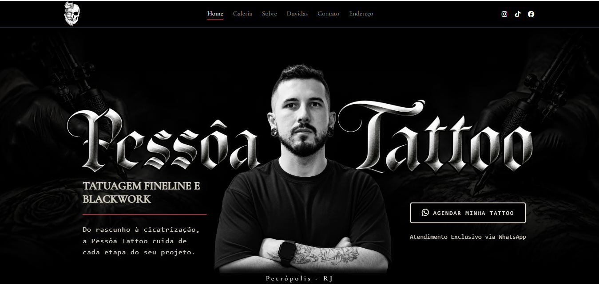
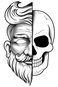
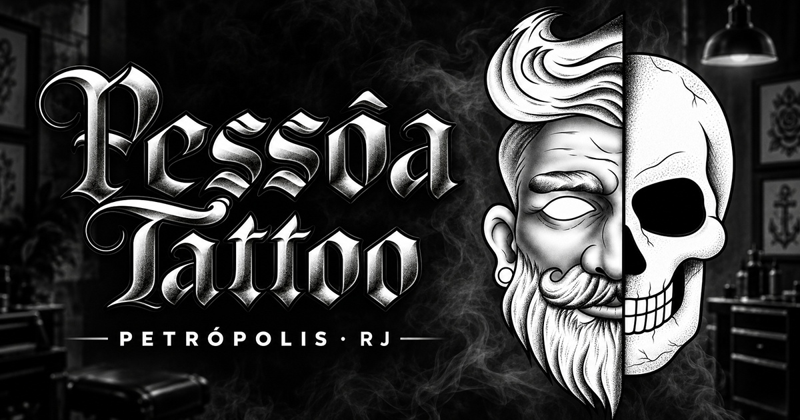

<div align="center">



<br />



# Pessôa Tattoo

**Site institucional para estúdio de tatuagem em Petrópolis - RJ**

Página única, sem framework e sem etapa de build — HTML, CSS e JavaScript puros.

[](#)
[](#)
[](#)

</div>

---

## Sobre

Site de divulgação do estúdio do tatuador Lucas, que trabalha com fineline,
blackwork e realismo. Reúne portfólio, informações de contato, endereço e
agendamento direto pelo WhatsApp.

O projeto é intencionalmente sem dependências: nada de framework, bundler ou
`node_modules`. É HTML, CSS e JS que rodam abrindo o arquivo no navegador.

## Prévia de compartilhamento

<div align="center">



<sub>Card gerado ao compartilhar o link no WhatsApp e nas redes sociais,
via Open Graph</sub>

</div>

## Funcionalidades

- **Galeria com carrossel** e filtro por categoria (blackwork, fineline, realismo)
- **Lightbox** para ampliar as fotos, com `<dialog>` nativo
- **Animações na rolagem** — cada seção anima na primeira vez que entra na tela
- **Menu hambúrguer** abaixo de 500px
- **Botão flutuante de WhatsApp** que aparece depois que o hero sai da tela
- **Acordeão de dúvidas frequentes**
- **Mapa do Google** incorporado

## Decisões técnicas

**Imagens em WebP.** As 20 fotos do portfólio somam 1,8 MB — as mesmas em PNG
dariam cerca de 40 MB. A logo sozinha caiu de 2,19 MB para 10 KB.

**Carregamento em camadas.** As imagens acima da dobra carregam de imediato; as
16 restantes usam `loading="lazy"`. O fundo do hero, que é o elemento LCP, tem
`preload` porque, por ser `background-image` de CSS, o navegador só o
descobriria depois de ler todas as folhas de estilo.

**Animações que não custam caro.** Só `transform` e `opacity`, que rodam na GPU
sem provocar reflow. Ficam pausadas via `animation-play-state` e são liberadas
por um `IntersectionObserver`, que para de observar a seção após o primeiro
disparo. `prefers-reduced-motion` é respeitado.

**CSS sem pré-processador.** Usa aninhamento nativo e variáveis em `:root`. Os
arquivos são separados por breakpoint e **a ordem dos `<link>` importa**: media
query não tem especificidade extra, só vence por vir depois. Por isso vão do
mais largo para o mais estreito.

**SEO e compartilhamento.** Open Graph para a prévia no WhatsApp e ficha
JSON-LD do tipo `TattooParlor`, com horários e coordenadas, para os resultados
de busca local.

## Estrutura

```
.
├── index.html          página única
├── global.css          reset, variáveis de tema e tags base
├── style.css           componentes (desktop)
├── style-1050.css      ┐
├── style-900.css       │ breakpoints, do mais largo
├── style-520.css       │ para o mais estreito
├── style-500.css       ┘
├── animations.css      keyframes e utilitárias de animação
├── robots.txt
├── sitemap.xml
├── js/
│   └── main.js         carrossel, filtros, lightbox, menu e observers
└── img/                fotos em .webp e os originais em .png
```

> A ordem em que os CSS são carregados no `<head>` é obrigatória.
> Trocar duas linhas de lugar quebra o responsivo sem erro no console.

## Rodando localmente

Não há dependências nem build. Basta clonar e abrir:

```bash
git clone https://github.com/daviobl2014-hub/Site-Pessoa-Tattoo.git
cd Site-Pessoa-Tattoo
```

Abra o `index.html` no navegador, ou suba um servidor local para evitar
restrições de origem no mapa incorporado:

```bash
python -m http.server 8000
```

## Status

Site concluído, em fase de publicação.

- [x] Layout responsivo
- [x] Otimização de imagens
- [x] SEO e Open Graph
- [ ] Domínio próprio e deploy em produção

---

<div align="center">
<sub>Desenvolvido por <b>Davi Casa</b></sub>
</div>
